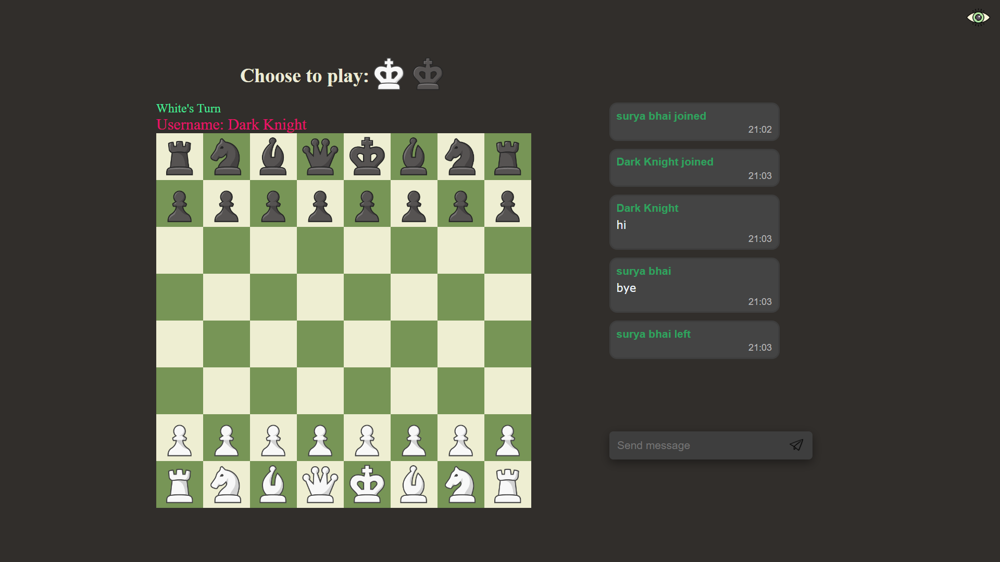

---

# chessNchat

Welcome to **chessNchat**, a real-time chess game with integrated chat functionality. This project utilizes websockets through the Socket.IO library, enabling users to engage in live chess matches and communicate with opponents via chat.

## Features

- Real-time chess gameplay.
- Chat functionality for communicating with opponents.
- Users can create and share unique room links.
- Spectator mode for other users in the room.
- Players can choose their color (black or white) before starting a match.

## Installation

To get started, follow these steps:

1. **Clone the Repository:**

   After forking the repository, navigate to the "App" directory in your terminal:

   ```bash
   cd App
   ```

2. **Install App Dependencies:**

   Install the required dependencies for the "App" directory using npm:

   ```bash
   npm install
   ```

3. **Install Server Dependencies:**

   Return to the main directory and navigate to the "Server" directory:

   ```bash
   cd ..
   cd Server
   ```

   Install the necessary dependencies for the "Server" directory:

   ```bash
   npm install
   ```

4. **Configure Environment Variables:**

   Create a file named `config.env` in the "Server" directory to store environment variables. Define the following variables:

   ```env
   DATABASE=your_database_string_with_password
   ACCESS_TOKEN_SECRET=your_random_string
   ```

   Save the file after adding the variables.

5. **Run the Server:**

   In the "Server" directory, start the server by running:

   ```bash
   nodemon app.js
   ```

   This will launch the server on port 3001.

6. **Access the App:**

   After successful authentication, you'll be directed to the app's homepage. You can either join an existing room using a link (URL) or generate a new link and join that room. For testing purposes, open the same URL in multiple tabs to simulate multiple users.Actual app is served from server as dist file and authentication pages are also served from server as .ejs files 
   
---


